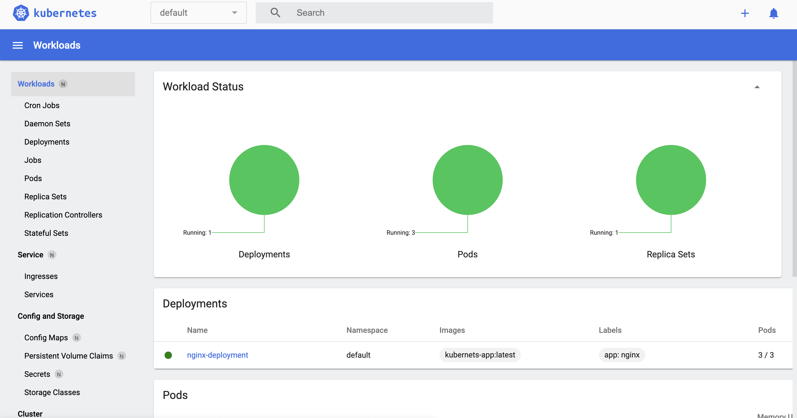

# Get Started

## Install dependences for run application

- [Docker install](https://docs.docker.com/desktop/mac/install/)
- [kubectl install](https://kubernetes.io/docs/tasks/tools/)
- [Minikube install](https://minikube.sigs.k8s.io/docs/start/)

<br>

```bash

minikube start

#and

minikube dashboard

```

# Run application:

```bash
# run kubectl from create pod

kubectl create -f deployment.yml

```

Create replic containers in kubernetes:

```bash

kubectl scale deployment nginx-deployment --replicas=3

```


